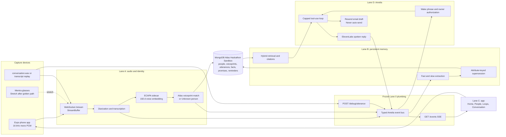

# Amelia agent guide

## Mission

Amelia is a phone-first persistent-context system for live conversations. It separates speakers, attributes utterances using voiceprints, builds append-only per-person memory, and exposes a voice-summoned agent that only responds to an authorized owner voiceprint. The hackathon build targets the MongoDB Atlas Hackathon Sandbox and a public repository.

The product claim is: Amelia remembers not only what was said, but who said it, when it changed, and what still needs to happen.

## Read this first

Before changing code:

1. Read `shared/contracts.ts` completely.
2. Read `PROGRESS.txt` and run `git status --short --branch`.
3. Determine your lane and edit only its owned paths.
4. Treat the frozen files and cross-lane surfaces below as APIs.
5. Run the smallest relevant tests while working, then `bun run test` and `bun run typecheck` before handoff.

Do not infer that a component in the target architecture is already implemented. Verify it in the repository. Architecture diagrams must distinguish `implemented`, `scaffolded`, `planned`, and `stretch` components.

## Current repository baseline

Lane 0 established the shared foundation:

- Bun workspaces and frozen dependency lockfile.
- Expo app configuration with microphone and notification permissions.
- Hono server composition in `server/index.ts`.
- Typed in-process event bus and SSE hub in `server/lib/bus.ts`.
- Full cross-lane types and constants in `shared/contracts.ts`.
- Fixture transcript, four-speaker 16 kHz WAV, replay utility, and owner seed.
- Atlas index definitions and application script.
- `POST /debug/utterance`, `GET /events`, and `GET /health` integration seams.

Some lane directories initially contain registration placeholders. A file existing is not proof that the lane is complete. Consult `PROGRESS.txt`, tests, and the implementation itself.

## Target architecture



The event bus is the integration backbone. Audio, memory extraction, Amelia, and SSE consume the same finalized utterance events. Lanes do not import one another's internal modules.

## Frozen integration contracts

These files were frozen by Lane 0 and must not be edited casually:

- `shared/contracts.ts`
- `server/index.ts`
- `server/lib/bus.ts`
- root and workspace `package.json` files
- `bun.lock` and `bunfig.toml`
- `app/app.json`
- `app/metro.config.js`
- `tsconfig.json`

If a frozen contract truly must change, announce it to the team, coordinate with the contracts owner, update every consumer, and run the full suite. Do not add a dependency from a lane branch without that coordination.

The important fixed values are:

| Contract | Value |
|---|---:|
| PCM stream | float32, 16 kHz, mono |
| Frame duration | 100 ms |
| Frame size | 1,600 samples / 6,400 bytes |
| Minimum voice embedding audio | 3,000 ms |
| ECAPA voiceprint dimensions | 192 |
| Voyage model | `voyage-3.5-lite` |
| Voyage dimensions | 1,024 |
| Attribution threshold | 0.75 |
| Owner authorization threshold | 0.60 |
| Amelia tool-call cap | 5 |

The first WebSocket `/stream` frame is JSON `{ "conversation_id": "..." }`; subsequent frames are raw PCM binary frames.

SSE events are the `AmeliaEvent` union from `shared/contracts.ts`: `utterance`, `identity`, `fact`, `promise`, `amelia_step`, and `amelia_audio`. Re-emitting an `utterance` event with the same `utterance_id` replaces the previous revision in the UI.

Lane D may call only Lane B's exported memory surface:

- `searchMemory(query, personId?)`
- `getPerson(id)`
- `resolveFactState(personId, attribute)`
- `createReminder(promiseId, fireAt)`
- `addNote(personId, text)`

Lane C may consume Lane A audio only through `useAudioUplink(conversationId)` with the state machine declared in the shared contracts.

## Ownership and branch rules

Directory ownership is absolute during parallel work.

| Lane | Branch | Owned paths | Responsibility |
|---|---|---|---|
| Lane 0 | `main` | frozen files, `shared/`, `fixtures/` | contracts, scaffold, fixtures, integration plumbing |
| Lane A | `lane-a` | `server/audio/`, `server/identity/`, `sidecar/`, `app/audio/` | PCM transport, diarization, transcription, voice identity, enrollment |
| Lane B | `lane-b` | `server/memory/`, `server/ask/`, `db/` | persistence, extraction, supersession, merge, retrieval |
| Lane C | `lane-c` | `app/` except `app/audio/` | mobile UI, SSE state, naming, local notifications |
| Lane D | `lane-d` | `server/amelia/`, `video/` | wake authorization, tools, TTS, email drafts, pitch and video |
| Lane E | `lane-e` | `server/glasses/` | stretch-only Mentra capture and playback |

Never edit another lane's tree, rebase a lane branch, or rewrite another contributor's work. Merge to `main` only at a gate. Communicate cross-lane needs through the frozen contracts, bus, or named exported surfaces.

## Lane behavior

### Lane A: audio and identity

- Use a monotonic sample cursor as the only audio clock.
- Assign words to diarization segments by word-midpoint containment.
- Emit revisions only in the audio spine; downstream systems replace by `utterance_id`.
- Replay `fixtures/conversation.wav` through the same StreamBuffer path as live audio.
- Accumulate at least 3 seconds per session speaker before embedding.
- ECAPA produces 192-dimensional vectors.
- Search voiceprints with cosine similarity filtered by `owner_id`.
- Below the strict attribution threshold, create an unnamed person and voiceprint; never guess.
- Owner wake authorization uses the separate, looser threshold.
- Never delete voiceprints.

### Lane B: memory and retrieval

- Consume finalized utterances from the bus, never Lane A internals.
- Fast pass: promises and reminders over an eight-turn labelled window.
- Slow pass: facts every 25 utterances.
- Facts are append-only and keyed by `(owner_id, person_id, attribute)` for supersession.
- Preserve the old fact and point it to its replacement; reads resolve only current facts.
- Facts and promises must be idempotent using the unique keys in `db/indexes.json`.
- Merge people by keeping the oldest person ID, re-pointing voiceprints, and performing bounded `updateMany` operations on utterances, facts, and promises. Emit one identity event per affected conversation.
- Prefer Atlas `$rankFusion`; keep a two-pipeline reciprocal-rank-fusion fallback.
- Use the emailed Atlas Hackathon Sandbox only.

### Lane C: mobile app

- Light theme only: cream, white, and light grey.
- Manrope for body text and Newsreader for display text.
- Phosphor icons only; no emoji or all-caps UI copy.
- Build mock SSE using imported shared event types.
- Apply utterance revisions in place without flicker.
- Preserve an unknown speaker's deterministic avatar after naming.
- Provide Home, People, Loops, and Conversation experiences.
- The two priority delight moments are speaker naming and Amelia's live step trace.
- Schedule local notifications for reminder events.

### Lane D: Amelia and demo

- Detect `hey amelia` only in finalized turns, case- and punctuation-insensitively.
- Authorize the speaker voiceprint before invoking tools.
- Stop after five tool calls and return the best partial result.
- Stream one `amelia_step` per meaningful action.
- Generate the final spoken response through ElevenLabs.
- Email is draft-only and requires a user tap to send through Resend.
- Keep a press-and-hold manual summon path as the stage fallback.
- The canonical demo command must retrieve a trip, resolve the current move state, branch correctly, draft an email, and speak the result.

### Lane E: glasses stretch

Start only after the phone golden path succeeds. Mentra audio enters the same StreamBuffer as phone audio. The wearable never leads the pitch; identity-aware memory is the product differentiator.

## Data and Atlas constraints

Use only the organizer-provided MongoDB Atlas Hackathon Sandbox. Do not create or fall back to a personal or free-tier cluster.

The search-index budget is three:

1. Voiceprints vector index: 192 dimensions, cosine, filter by owner.
2. Facts vector index: 1,024 dimensions, cosine, filter by owner and person.
3. Atlas Search index for fact claims and utterance text.

If the sandbox tier cannot host both vector indexes, remove the facts vector index and use Atlas Search for memory retrieval. Do not move the application to another cluster.

Secrets belong in `server/.env`, created from `server/.env.example`. Never commit credentials. Required integrations include MongoDB, Anthropic, OpenAI, pyannote, ElevenLabs, Voyage, Resend, and the public API URL.

## Gates and scope order

Cut scope before missing a gate.

| Gate | Required outcome |
|---|---|
| T+15 | Contracts, scaffold, fixtures, environment handoff |
| T+50 | Transcript replay through `POST /debug/utterance` to MongoDB, SSE, and separated UI speakers |
| T+100 | Real WAV through the complete audio spine, then live microphone and identity naming |
| T+150 | Golden path completes once; only now may glasses start |
| T-60 | No new features; noisy-corner dry run and fixes only |
| T-15 | Final video cut complete |

The golden path is: separate four speakers, create and name an unknown speaker, attach prior history, supersede a move-date fact, retrieve the current value with a citation, execute the canonical Amelia conditional command, draft and speak the answer, then surface a promise reminder.

## Commands

```bash
bun install
bun run dev
bun run dev:app
bun run test
bun run typecheck
bun run db:indexes
bun run seed
node fixtures/replay.mjs
```

Run `bunx expo-doctor` from `app/` after changing Expo dependencies or native configuration. The fixture gate can run without audio vendors; the live audio and Atlas gates require their credentials.

## Verification and handoff

Before declaring a lane ready:

- Run its focused tests.
- Run `bun run test` and `bun run typecheck`.
- Confirm no edits exist outside the lane's ownership.
- Exercise the lane's done condition, not merely its happy-path unit tests.
- Report which external services and physical devices were actually tested.
- Commit with the default Git author and include the commit hash in the handoff.

Do not claim Atlas indexes were applied without a successful connection to the organizer sandbox. Do not claim the iOS dev client was installed without a connected physical phone.

## Architecture-diagram rules

When asked for an architecture diagram, inspect the repository and use the canonical system prompt in `CLAUDE.md`. The result must be Mermaid, must show the event bus as the integration backbone, must show MongoDB Atlas as persistence and retrieval, and must visually distinguish implemented, scaffolded, planned, stretch, and external elements. Never invent an endpoint, collection, event, service, or data flow that is absent from both the code and this approved plan.
