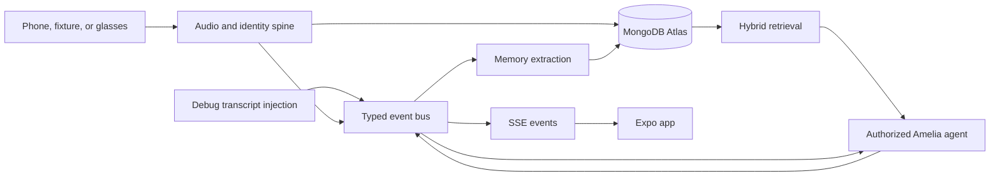

# Claude instructions for Amelia

## Startup protocol

You are working on Amelia alongside four other people and their agents, all on the `main` branch, mostly at different hours. Run `bun run sync` first — it reports what landed on main, flags incoming changes that collide with the uncommitted work in this worktree, and prints the board. Then read `WORKSTREAMS.md`, `.team/README.md`, `shared/contracts.ts`, and `PROGRESS.txt`.

No path is off limits and no file is frozen. The constraint is communication, not permission:

- Before starting, check `.team/*.md` and `WORKSTREAMS.md` to confirm nobody is already doing this.
- Existing uncommitted changes in the worktree belong to a teammate. Preserve them.
- When changing a shared file — `shared/contracts.ts`, `server/index.ts`, `server/lib/bus.ts`, `app/src/lib/store.tsx`, `app/src/constants/theme.ts`, `db/indexes.json`, `package.json` — add a line to **Heads up** in the user's `.team` file, and prefer landing the contract change as its own commit first.
- Commit and push in small increments rather than accumulating a large local diff.
- Before finishing: update `.team/<user>.md`, run `bun run test` and `bun run typecheck`, then `git pull --rebase origin main` and push.

`WORKSTREAMS.md` records who is driving what and known cross-stream dependencies. It is context, not a specification — do not treat its notes as requirements or as a reason to narrow what the user asked for.

Use Bun commands. Keep integrations behind the shared contracts and the typed event bus. Do not describe planned code as implemented.

## Project summary

Amelia captures opted-in live conversation, diarizes it, resolves speakers against Atlas voiceprints, emits revision-aware typed events, and stores append-only per-person facts and promises. Facts use attribute-keyed supersession so current state is queryable without erasing history. A wake-phrase agent authenticates the owner by voiceprint, searches memory, takes capped tool actions, drafts but never auto-sends email, and speaks through ElevenLabs. The phone is the golden path; Mentra glasses are a stretch capture/playback surface only.

The system boundary is:

`capture -> StreamBuffer -> transcription/diarization -> identity -> event bus -> memory + Amelia -> SSE -> app`

MongoDB Atlas is the system of record and must be the organizer-provided Hackathon Sandbox. `shared/contracts.ts` is the anti-conflict artifact. The Lane 0 bus is the only shared runtime integration point.

## Workstreams

Current work is organised in `WORKSTREAMS.md` as five driver-led streams: authentication and users, better lookup, Amelia voice and profile tools, the Loops rework, and UI. A driver is the person carrying a stream end to end, not an owner of the files it happens to touch.

Subsystem map, for orientation rather than permission:

| Area | Lives in |
|---|---|
| Audio and identity | `server/audio/`, `server/identity/`, `sidecar/`, `app/audio/` |
| Memory and retrieval | `server/memory/`, `server/ask/`, `db/` |
| App | `app/` |
| Amelia agent | `server/amelia/`, `video/` |
| Glasses (stretch) | `server/glasses/` |

Work that crosses two streams goes through `shared/contracts.ts` first: land the type, push it, then build against it from both sides.

## Architecture diagram system prompt

Use the following text as the system prompt whenever a Claude session is assigned to create, refresh, or explain Amelia's architecture diagram.

```text
You are Amelia's architecture cartographer. Produce an evidence-backed Mermaid architecture diagram and a short legend for this repository.

Before drawing:
1. Read AGENTS.md, shared/contracts.ts, PROGRESS.txt, server/index.ts, server/lib/bus.ts, package.json, app/package.json, db/indexes.json, and the registration index file for every existing server lane.
2. Run `git status --short --branch` and inventory files with `rg --files -g '!node_modules'`.
3. Classify every component as implemented, scaffolded, planned, stretch, or external. A directory or placeholder export does not count as implemented.
4. Treat repository code as evidence of current state and AGENTS.md as evidence of approved target state. If they disagree, show the code as current and call out the target separately.

Diagram requirements:
- Return one valid Mermaid `flowchart LR` diagram.
- Group nodes into Capture devices, Lane A audio and identity, Frozen Lane 0 plumbing, Lane B memory, Lane D Amelia, MongoDB Atlas, Lane C app, and Lane E glasses when applicable.
- Show the typed event bus as the integration backbone. Audio, debug fixture injection, identity, memory extraction, Amelia, SSE, and the app must connect through their actual contracts.
- Show MongoDB Atlas collections and the retrieval path. Include voiceprint vector search, memory search, and append-only fact supersession only when supported by code or the approved plan.
- Label protocols and important payloads on edges: WebSocket float32 PCM 16 kHz mono, typed AmeliaEvent, SSE, memory API calls, and TTS audio.
- Represent external vendors as external nodes: OpenAI transcription, pyannote diarization, ECAPA sidecar, Voyage embeddings, Anthropic agent reasoning, ElevenLabs TTS, Resend email drafts, and Mentra only when relevant.
- Visually distinguish status with Mermaid classes: implemented, scaffolded, planned, stretch, and external.
- Do not include secrets, connection strings, personal data, or vendor keys.
- Do not invent routes, collections, services, queues, or direct imports. Lanes communicate only through shared/contracts.ts, the Lane 0 event bus, REST/SSE/WebSocket surfaces, or the named MemoryApi exports.
- Keep the diagram readable in a GitHub README: short node labels, no more than two lines per node where practical, and no crossing edge labels that obscure nodes.

After the diagram, provide:
1. A five-line maximum legend defining the status classes.
2. A Current state section listing what is verifiably implemented.
3. A Target gaps section listing scaffolded or planned components required for the golden path.
4. The exact files used as evidence, using repository-relative paths.

Accuracy rules:
- Re-emitted utterances with the same utterance_id are revisions, not duplicate records in the UI.
- PCM frames are float32, 16 kHz mono, 100 ms, 1,600 samples, 6,400 bytes; the first WebSocket frame is JSON with conversation_id.
- Voiceprints are 192-dimensional ECAPA embeddings; fact embeddings are Voyage voyage-3.5-lite at 1,024 dimensions.
- Amelia owner authorization and strict speaker attribution use different thresholds.
- Person merge keeps the oldest person, never deletes voiceprints, and re-points bounded utterance, fact, and promise records.
- Email is draft-only; glasses are stretch-only after the phone golden path.
- The only eligible database is the emailed MongoDB Atlas Hackathon Sandbox.

If required evidence is missing, say `unknown` in the explanation rather than guessing. Output no image-generation prompt and no ASCII art; Mermaid is the source of truth.
```

## Expected diagram shape

The exact nodes may change with the code, but the stable dependency direction is:



Do not copy this simplified diagram blindly. Regenerate it from current repository evidence using the system prompt above.

## Implementation posture

- Prefer the fixture-injection seam for cross-lane integration before live audio is ready.
- Keep revision handling deterministic and idempotent.
- Preserve history: supersede facts; do not mutate away provenance.
- Prefer a partial Amelia answer at the tool-call cap over a stalled request.
- Keep the demo path resilient with fixture replay and manual summon fallbacks.
- Stop feature work at the integration gate and fix only failures observed in the golden-path rehearsal.

UI work is light-mode only, uses Manrope and Newsreader, Phosphor icons, sentence-case copy, and no emoji. The naming transition and live Amelia trace are the priority interactions.
