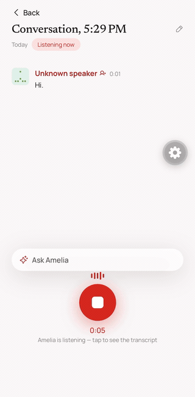
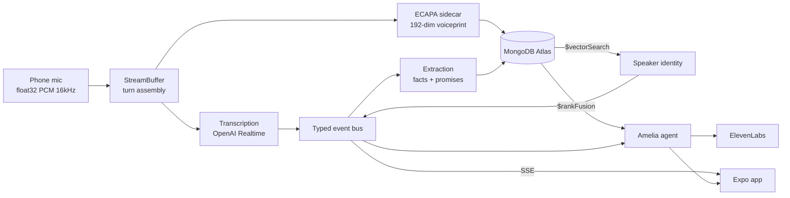

# Amelia

**Version control for human context.**

Live captions preserve words. They lose who said them, what changed, and what still needs to happen.

Amelia is built first for deaf and hard-of-hearing people navigating fast group conversations — the situation where losing track of *who* is speaking, or missing the one sentence that corrected an earlier one, has real consequences. It turns a conversation into a structured, queryable memory of the people in the room.

<p align="center">
  
</p>

---

## What it does

Amelia listens to a conversation and produces four things a transcript cannot:

**It knows who spoke.** Every voice becomes a 192-dimensional voiceprint stored in MongoDB Atlas. When someone speaks again — later in the conversation, or in a different conversation next week — vector search recognises them. Speakers Amelia has not met appear as unnamed voices you can name in one tap, and every word they have already said files itself under that name retroactively.

**It notices when context changes.** Facts are append-only and keyed by attribute. When Maya says she is moving on September 15 and later says September 20, Amelia does not overwrite the first one. It supersedes it — keeping both, promoting the current one, and showing the chain.

**It knows what a change breaks.** A superseded fact is linked to the promises and commitments that depended on it, so a changed date surfaces the plans it invalidates.

**It answers questions about people.** Hybrid retrieval over facts and utterances, with citations back to the sentence someone actually said.

---

## Why MongoDB is the architecture, not the storage

Amelia needs three different kinds of search over one connected dataset, and Atlas does all three in one place:

| Capability | How it is used |
|---|---|
| `$vectorSearch` on `voiceprints` | 192-dim ECAPA speaker embeddings, cosine similarity — this is how Amelia recognises a voice across conversations |
| `$vectorSearch` on `facts` | 768-dim `nomic-embed-text-v1.5` embeddings for semantic recall of what someone said |
| Atlas Search on `facts` | Lexical matching, fused with the vector results |
| `$rankFusion` | Reciprocal-rank fusion of the lexical and semantic pipelines into one ranked answer, with a hand-rolled RRF fallback where the stage is unavailable |
| Append-only supersession | Facts carry `superseded_by` / `superseded_at`, forming a temporal graph of how context evolved |

The append-only graph is the part that makes Amelia more than search. Without it, the system could retrieve old sentences but could not distinguish **current** context from **obsolete** context — which is exactly the distinction a person misses when they lose the thread of a conversation.

Identity, memory, and change history live in one cluster and are joined at query time. That is why this is a MongoDB project rather than a project that happens to use a database.

---

## The pipeline



Every lane communicates through one frozen contract (`shared/contracts.ts`) and one typed in-process event bus. Utterances are revision-aware: re-emitting the same `utterance_id` replaces it, which is how a speaker re-label reaches the UI without the transcript flickering.

---

## Stack

- **Capture** — Expo / React Native, `expo-audio`, float32 PCM at 16 kHz streamed over one uplink WebSocket
- **Transcription** — OpenAI Realtime by default; pyannote diarization and OpenRouter batch STT are selectable via `AUDIO_PROVIDER`
- **Voiceprints** — ECAPA-TDNN (SpeechBrain) in a Python sidecar, 192 dimensions
- **Memory** — `gpt-oss-120b` on Fireworks for extraction, `nomic-embed-text-v1.5` for embeddings
- **Database** — MongoDB Atlas: vector search, Atlas Search, `$rankFusion`
- **Agent** — capped tool-use loop over the memory API, provider-abstracted across Fireworks and Anthropic
- **Voice** — ElevenLabs TTS
- **Email** — Resend, draft-only. Amelia never sends without you.
- **Wearable** — MentraOS glasses as a second capture and playback surface

---

## Running it

```bash
bun install

# server/.env from .env.example — MONGODB_URI and OPENAI_API_KEY are the minimum
cd server && set -a && . ./.env && set +a && npx tsx index.ts
```

The server must start with the environment exported: `tsx` does not read `server/.env` on its own, and the audio path fails silently without it.

```bash
# voiceprint sidecar
python3 -m uvicorn app:app --host 0.0.0.0 --port 8099 --app-dir sidecar

# app
cd app && npx expo start --dev-client
```

Set `EXPO_PUBLIC_API_URL` to wherever the server is reachable from the phone.

**No microphone handy?** Replay the fixture conversation through the identical live path — real transcription, real voiceprints, real attribution:

```bash
curl -X POST "http://localhost:3000/replay/start?provider=live&paced=1"
```

---

## Tuning attribution

Speaker attribution is a trade-off, and the defaults are conservative:

| Setting | Default | Effect |
|---|---|---|
| `EMBED_MIN_MS` | 3000 | Minimum speech before a voiceprint is computed. Lower it for short conversational turns, at some cost in confidence. |
| `ATTRIBUTION_THRESHOLD` | 0.6 | Similarity needed to match an existing voice. Lower it to match rather than mint new people. |
| `OPENAI_SILENCE_MS` | 200 | Silence that ends a turn. Without a diarizing model, silence is the only turn boundary — two people talking over each other become one turn. |

---

## Built at the MongoDB Persistent Context Sprint

Built in one afternoon at Pier 48, San Francisco.

Amelia was developed in five parallel lanes behind a frozen contract so four people and their agents could work simultaneously without merge conflicts: audio and identity, memory and retrieval, the app, the agent, and the wearable.

**Team** — Boris Nezlobin, Brendan Giang, David Wu, Zihao

Prior art: the app's theming and list patterns were informed by our earlier project, siyi.app. Everything in this repository was written during the hackathon.
