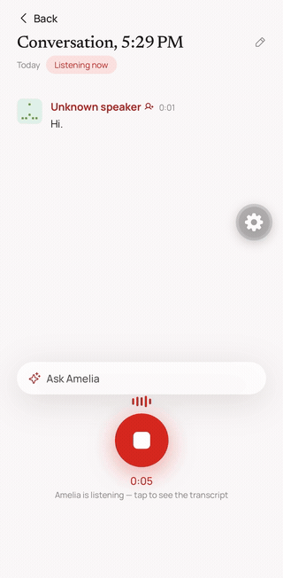
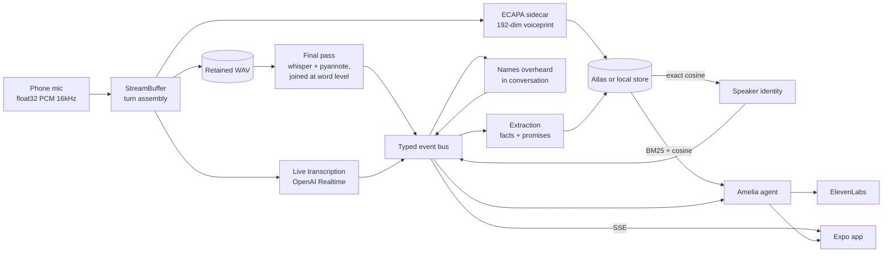

# Amelia

**Version control for human context.**

Live captions preserve words. They lose who said them, what changed, and what still needs to happen.

Amelia is built first for deaf and hard-of-hearing people navigating fast group conversations — the situation where losing track of *who* is speaking, or missing the one sentence that corrected an earlier one, has real consequences. It turns a conversation into a structured, queryable memory of the people in the room.

<p align="center">
  
</p>

---

## What it does

Amelia listens to a conversation and produces four things a transcript cannot:

**It knows who spoke.** Every voice becomes a 192-dimensional ECAPA voiceprint. When someone speaks again — later in the conversation, or in a different conversation next week — cosine matching over their stored prints recognises them. Speakers Amelia has not met appear as unnamed voices you can name in one tap, and every word they have already said files itself under that name retroactively. Naming a voice is also what enrols it, so the next conversation starts already knowing them.

**It learns names from the conversation itself.** People say each other's names constantly. When someone says "Also Josh, tomorrow — do you want to go to the game night?", Amelia proposes *Josh* for the voice being addressed, quotes the sentence it heard it in, and waits for one tap. It never renames anyone on its own.

**It notices when context changes.** Facts are append-only and keyed by attribute. When Maya says she is moving on September 15 and later says September 20, Amelia does not overwrite the first one. It supersedes it — keeping both, promoting the current one, and showing the chain.

**It knows what a change breaks.** A superseded fact is linked to the promises and commitments that depended on it, so a changed date surfaces the plans it invalidates.

**It answers questions about people.** Hybrid retrieval over facts and utterances, with citations back to the sentence someone actually said.

---

## Where the data lives

MongoDB Atlas is the system of record: people, voiceprints, conversations, utterances, facts, promises and reminders, joined at query time.

It is not a hard dependency, and that is deliberate. Amelia is used on campus wifi, where the cluster is frequently unreachable — during development the Atlas IP access list rejected the venue network outright. Identity that stops working when the network does is useless for the thing this product is for, so storage sits behind a driver interface with a durable local implementation, and the server reports which one is live on `GET /health` rather than pretending. Atlas becomes a sync target instead of a prerequisite (`bun run db:migrate`).

| Capability | How it is used |
|---|---|
| Append-only supersession | Facts carry `superseded_by` / `superseded_at`, forming a temporal graph of how context evolved |
| Attribute-keyed facts | Current state per person is a query, not a mutation, so history is never overwritten |
| Exact cosine over voiceprints | 192-dim ECAPA embeddings, scored in process. At tens to low hundreds of prints this is microseconds and exact, where approximate nearest neighbour only adds recall risk |
| BM25 + cosine, fused by rank | Lexical and semantic retrieval over facts *and* raw transcript, fused by reciprocal rank |

The append-only graph is the part that makes Amelia more than search. Without it, the system could retrieve old sentences but could not distinguish **current** context from **obsolete** context — which is exactly the distinction a person misses when they lose the thread of a conversation.

Earlier versions ran identity and retrieval on `$vectorSearch`, Atlas Search and `$rankFusion`. Those were moved in process for the reachability reason above, and because at one person's corpus size exact scoring is both faster than the round trip and better than an approximation. The document model, the supersession graph and the query patterns are unchanged.

---

## The pipeline


```mermaid
flowchart LR
    Mic["Phone mic<br/>float32 PCM 16kHz"] --> Buffer["StreamBuffer<br/>turn assembly"]
    Buffer --> ASR["Live transcription<br/>OpenAI Realtime"]
    Buffer --> Print["ECAPA sidecar<br/>192-dim voiceprint"]
    Buffer --> Wav[("Retained WAV")]
    Wav --> Final["Final pass<br/>whisper + pyannote,<br/>joined at word level"]
    Final --> Bus
    Print --> Store[("Atlas or local store")]
    ASR --> Bus["Typed event bus"]
    Store -->|"exact cosine"| Ident["Speaker identity"]
    Ident --> Bus
    Bus --> Name["Names overheard<br/>in conversation"]
    Name --> Bus
    Bus --> Mem["Extraction<br/>facts + promises"]
    Mem --> Store
    Store -->|"BM25 + cosine"| Agent["Amelia agent"]
    Bus --> Agent
    Agent --> TTS["ElevenLabs"]
    Bus -->|SSE| App["Expo app"]
    Agent --> App
```

Every lane communicates through one frozen contract (`shared/contracts.ts`) and one typed in-process event bus. Utterances are revision-aware: re-emitting the same `utterance_id` replaces it, which is how a speaker re-label reaches the UI without the transcript flickering.

---

## Stack

- **Capture** — Expo / React Native, `expo-audio`, float32 PCM at 16 kHz streamed over one uplink WebSocket
- **Transcription** — OpenAI Realtime for the live pass, so text appears within a second with provisional speakers on it
- **Correction** — when recording stops, whisper-1 transcribes the whole retained file and pyannote 3.1 diarizes it, and the two are joined at **word** level. A whisper segment routinely spans a speaker change, so attributing whole segments hands one person the other's words. On the owner's 48-minute recording this produces 526 turns from 8,035 words with 99.4% of them on a speaker, and it reports 776 s of simultaneous speech rather than serialising it into a rapid alternation of short segments
- **Voiceprints** — ECAPA-TDNN (SpeechBrain) in the same Python sidecar, 192 dimensions. Identity, not diarization: telling this room's voices apart is pyannote's job, recognising one of them next week is this one's
- **Memory** — `gpt-oss-120b` on Fireworks for extraction, `nomic-embed-text-v1.5` for embeddings
- **Storage** — MongoDB Atlas as the system of record, behind a driver interface with a durable local store so identity survives an unreachable cluster
- **Agent** — capped tool-use loop over the memory API, provider-abstracted across Fireworks and Anthropic
- **Voice** — ElevenLabs TTS
- **Email** — Resend, draft-only. Amelia never sends without you.
- **Wearable** — MentraOS glasses as a second capture and playback surface

---

## Running it

```bash
bun install
cp .env.example .env      # OPENAI_API_KEY is the only one truly required
```

Without `MONGODB_URI`, or with an unreachable cluster, everything still works against the local store — `GET /health` reports which backend is live rather than claiming `ok` over a dead database.

The speaker sidecar is a separate Python process holding both torch models — ECAPA for voiceprints and pyannote for diarization. Identity does not work without it, and neither does the correction pass:

```bash
cd sidecar
uv venv --python 3.12 .venv && uv pip install --python .venv/bin/python -r requirements.txt
ECAPA_CACHE_DIR=.cache/ecapa .venv/bin/python -m uvicorn app:app --host 127.0.0.1 --port 8099
```

It loads both models at startup rather than on first request, so give it half a minute; `GET /health` returns `ok` once ECAPA is warm and `diarization: true` once pyannote is.

pyannote's weights are gated on Hugging Face: accept the terms for `pyannote/speaker-diarization-3.1` and `pyannote/segmentation-3.0`, then export `HF_TOKEN` before starting the sidecar. Without it the sidecar still embeds voiceprints, `/health` says why diarization is unavailable, and the final pass reports that it could not run instead of quietly leaving the live pass's guesses in place.

Diarization runs at roughly **1.2x realtime on CPU** — about 40 minutes for a 48-minute recording. That is fine for a pass that runs after recording stops and impossible for a live one, which is why the two-pass split exists.

```bash
# server — must be started with the environment exported
set -a && . ./.env && set +a && npx tsx server/index.ts

# app
cd app && npx expo start --dev-client
```

Set `EXPO_PUBLIC_API_URL` to wherever the server is reachable from the phone.

**No microphone handy?** Drive the real capture path from a recording. This speaks the exact wire protocol the phone speaks — WebSocket, float32 PCM, 1,600-sample frames — so transcription, clustering, the sidecar, identity and SSE are all genuinely exercised:

```bash
PROBE_SPEED=1 npx tsx tools/probe-mic-path.mts
```

## Measuring speaker identification

The thresholds in `shared/contracts.ts` are properties of a microphone and a room, not of the code, so the only honest way to know whether a change helped is to re-measure:

```bash
bun run eval:speakers          # scores the real pipeline against known ground truth
bun run eval:diarization       # scores the final pass against both real recordings
bun run eval:diarization --snap   # and sweeps the word-join's snap tolerance
```

`eval:diarization` runs over saved inputs — the whisper transcript and the pyannote turns — so it costs nothing and can be re-run on every change. Regenerate the diarization when the diarizer changes, which takes about as long as the recording:

```bash
npx tsx eval/real/diarize-fixture.mts dorm-9pm
```

Read the landmark lines before the error rate. The rate cannot see the failure that matters: merging two people who barely overlap in time costs almost nothing in seconds, and merging one pair while splitting another leaves the speaker count looking correct. The landmarks are lines whose speaker the words themselves settle — a self-introduction names its own speaker — so they move for nobody's threshold.

`fixtures/real/dorm-9pm.wav` is three people in a dorm room with the phone flat on a desk. Two things learned the hard way and worth keeping in mind before touching any threshold:

- **Synthetic audio lies.** The original constants were tuned on a TTS fixture that reported within-speaker cosine of 0.758. Real room audio gives 0.329. Identification simply never fired, which reads as a missing feature rather than a bad number.
- **A benchmark of only enrolled speakers cannot detect a false accept.** Always include trials from someone who was never enrolled. Most voices this thing hears are strangers, and handing a stranger a friend's name files their promises under the wrong human — the one error a user will never catch.

`eval/cross-session.test.ts` is the acceptance gate: enrol from one half of the recording, restart the process, recognise them in the other half, and refuse the stranger.

Because `fixtures/real/` is gitignored, every test that depends on a real recording skips on a fresh clone. That is right for a clone and wrong when you think you are validating something, so:

```bash
bun run test:full     # same suite, but a missing fixture FAILS instead of skipping
```

Use it before believing a change to identification, naming, or retrieval. A silently skipped acceptance test is the most expensive kind of green.

---

## Tuning attribution

Every default below was measured on `fixtures/real/dorm-9pm.wav`, and the reasoning is in the comments beside each constant in `shared/contracts.ts`. Change them from evidence, not from intuition — `server/audio/config.ts` prints any override at startup and refuses one that loosens a measured floor.

| Setting | Default | Effect |
|---|---|---|
| `EMBED_MIN_MS` | 3000 | Minimum speech before a voiceprint is computed at all. |
| `PROVISIONAL_SPEECH_MS` | 8000 | Pooled speech before a name is offered, hedged. Around here accuracy crosses ~88%. |
| `CONFIRMED_SPEECH_MS` | 20000 | Pooled speech before an identification is settled and allowed to reinforce a voiceprint. Measured 100%. |
| `ATTRIBUTION_THRESHOLD` | 0.68 | Raw cosine needed to match an existing voice. Sits in the measured gap between the nearest impostor (0.639) and the weakest true match (0.746). |
| `ATTRIBUTION_MARGIN` | 0.05 | How far the best candidate must beat the runner-up. Below this it refuses rather than guesses between two roommates. |
| `OPENAI_SILENCE_MS` | 500 | Silence that ends a turn. There is no good value — short shatters the tail into unusable fragments, long puts three people in one turn — which is why turns longer than a few seconds are split by voice for attribution instead. |

The recurring principle: **splitting one person in two is recoverable with a tap; merging two people is not.** A conflated pair files one person's facts and promises under the other's name, silently, and the user may not notice for weeks. Where the two errors compete, the code chooses to split.

Live attribution currently runs around 30% speaker error on real three-way conversation, and it is noisy run to run. Provisional identities render as guesses in the app for exactly that reason.

---

## Built at the MongoDB Persistent Context Sprint

Built in one afternoon at Pier 48, San Francisco.

Amelia was developed in five parallel lanes behind a frozen contract so four people and their agents could work simultaneously without merge conflicts: audio and identity, memory and retrieval, the app, the agent, and the wearable.

**Team** — Boris Nezlobin, Brendan Giang, David Wu, Zihao

Prior art: the app's theming and list patterns were informed by our earlier project, siyi.app. Everything in this repository was written during the hackathon.
